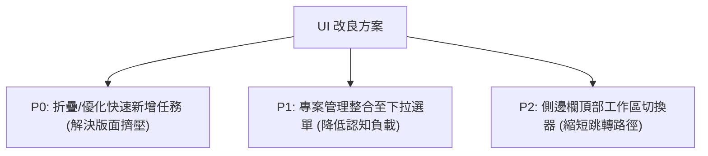

# 產品體驗分析報告：Task Tracker UI/UX 深度體檢

作為資深產品經理（Product Manager），我針對目前 Task Tracker 的 UI/UX 設計進行了深度評估。本報告將從**產品定位、使用場景、認知負載與操作動線**等維度，剖析現有畫面的優缺點，並提出最具投資報酬率（ROI）的改善方案。

---

## 一、 產品定位與設計語言定位 (Product Identity)

> [!NOTE]
> **獨特的手繪草稿風格 (Hand-drawn / Sketch UI)**
> 目前專案採用的「手繪風」邊框與手寫感字體是非常強烈且有記憶點的設計（類似 Excalidraw 或 Balsamiq）。這種設計非常適合**開發團隊、創意設計團隊或早期新創**，能降低用戶對正式系統的防備感，鼓勵隨手記錄、快速疊代。

---

## 二、 現有 UI 畫面的四大優點 (Pros)

### 1. 資訊階層清晰的 Kanban 卡片設計
* **優點**：卡片成功區分了 `.task-card-top`（標題與描述）與 `.task-card-mid`（專案、負責人、截止日期），使點擊彈出 Modal 的引導範圍變大。
* **PM 視角**：在資訊展示上做到了「沒資料就塌陷收縮」，避免了無意義的空白佔位，讓單卡高度控制在 `330px` 內，看板縱向空間利用率高。

### 2. 進階屬性面板的側邊欄分流 (Jira/Linear 風格)
* **優點**：在任務詳情 Modal 中，左側集中於「內容與交流」（標題、描述、留言、附件），右側集中於「中繼屬性」（狀態、指派人、優先度）。
* **PM 視角**：這種分流符合現代主流專案管理軟體（如 Jira, Linear）的用戶心智模型，使用者不需要重新適應。

### 3. 成員管理與邀請的極簡動線
* **優點**：邀請表單整合了 500ms 的 Debounce 與雙向模糊搜尋（姓名與 Email 皆可查），表單下方直接呈現成員權限的 Select 下拉修改與「移除」按鈕。
* **PM 視角**：邀請與權限變更不需要分頁操作，即時修改、即時生效的 PATCH 設計大大減少了用戶的等待感。

### 4. 工作區列表的視覺優化
* **優點**：狀態 Badge 簡化為「紅、灰、空心」小圓點，且將已刪除（Deleted）工作區下沉至最末端。
* **PM 視角**：利用小圓點建立視覺錨點，能讓用戶在一秒內掃描所有工作區狀態，同時下沉 Deleted 工作區可減少日常操作噪音。

---

## 三、 現有 UI 畫面的缺點與痛點 (Cons)

### 1. 看板頁面的「快速新增任務 (Quick Add)」佔用過多垂直空間
* **痛點**：目前的「快速新增任務」表單常駐在看板頂部，擁有 7 個輸入欄位，奪走了整個畫面的焦點。
* **PM 視角**：這會導致在筆記型電腦等小螢幕上，用戶進入看板後**第一眼看不到任何看板卡片**（折疊高度被擠壓）。快速新增應該是「快速且輕量」的，目前的設計負載過重。

### 2. 「建立專案 (Create Project)」表單與篩選器混雜
* **痛點**：`+ 專案` 的建立輸入框直接擺在 `所有專案` 篩選下拉選單旁邊。
* **PM 視角**：這違反了「唯讀篩選（Read）」與「寫入建立（Write）」操作分離的原則。用戶容易誤以為要在輸入框內打字才能進行篩選。

### 3. 工作區切換動線過長 (High-Click Cost)
* **痛點**：用戶一旦進入某個工作區，如果想切換到另一個工作區，必須點擊側邊欄底部的「回到工作區列表」連結，再在新頁面點選。
* **PM 視角**：頻繁切換工作區是用戶的日常習慣，目前的切換需要經歷「點擊 -> 載入頁面 -> 再點擊」的 2-Click 流程，效率低下。

### 4. 詳情 Modal 右側屬性面板視覺單調
* **痛點**：指派人、狀態、優先度都是瀏覽器預設的純文字 Select 下拉選單。
* **PM 視角**：相較於卡片上五顏六色的優先度 Badge 與圓點，詳情面板的 dropdown 顯得有些陽春，缺乏高級感（Premium Feel）。

---

## 四、 最需要改善的 Priority 建議 (Action Items)

根據影響範圍與開發複雜度，我建議優先針對以下三點進行改良：

### 【P0 - 看板版面優化】折疊「快速新增任務」表單
* **方案**：將頂部常駐的快速新增表單改為預設折疊，僅顯示一個 `+ 快速新增任務` 的按鈕。點擊後展開，或者在每個看板欄位（Todo / In Progress / Done）的頂部或底部，放一個 `+ 新增任務` 的小型輕量按鈕。
* **價值**：還給用戶 100% 的看板首屏可視度。

### 【P1 - 降低認知負載】分離專案篩選與專案建立
* **方案**：移除頂部導航欄的 `+ 專案` 文字表單。在 `專案篩選` 下拉選單的最下方，加入一個選項叫 `+ 管理/新增專案...`，點擊後彈出輕量小 Modal，統一管理專案的建立與重新命名。
* **價值**：保持頂部過濾區的純淨度。

### 【P2 - 提升多工效率】側邊欄「工作區下拉切換器」
* **方案**：在側邊欄頂部目前顯示「工作區名稱」的地方，改為下拉選單樣式。點擊可直接彈出可用工作區清單，並有 `+ 建立新工作區` 的快速選項。
* **價值**：將切換工作區的動線由 2-Click 且需要整頁跳轉，縮短為 1-Click 原地切換，極大提升使用者多工作業的順暢度。
